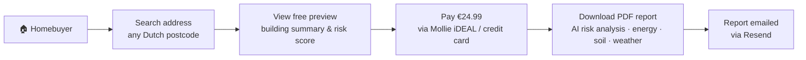
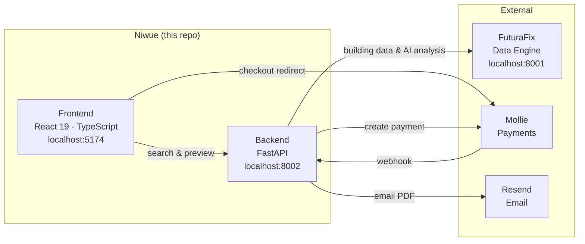
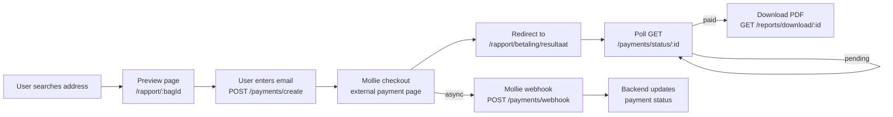
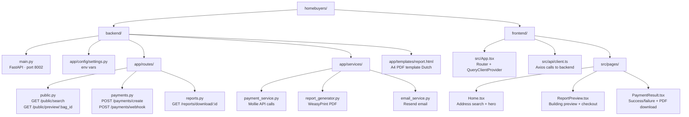
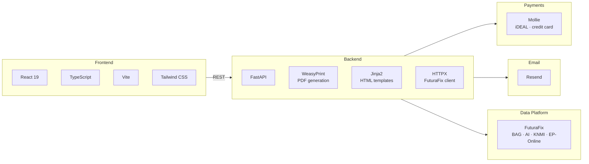

# 🏠 Homebuyers — Niwue

**Dutch Building Risk Reports for Homebuyers**

[](https://python.org)
[](https://fastapi.tiangolo.com)
[](https://react.dev)
[](https://typescriptlang.org)
[](https://mollie.com)
[](https://github.com/Louai609/futurafix.io)

Niwue lets homebuyers look up any Dutch address and purchase a full AI-powered building risk report — powered by the [FuturaFix](https://github.com/Louai609/futurafix.io) data platform.

---

## 📋 Table of Contents

- [How It Works](#-how-it-works)
- [Architecture](#️-architecture)
- [Payment Flow](#-payment-flow)
- [Project Structure](#-project-structure)
- [Quick Start](#-quick-start)
- [Environment Variables](#-environment-variables)
- [Tech Stack](#-tech-stack)

---

## 💡 How It Works



---

## 🏛️ Architecture



---

## 💳 Payment Flow



---

## 📁 Project Structure



---

## 🚀 Quick Start

### Prerequisites

- Python 3.11+
- Node.js 18+
- [FuturaFix](https://github.com/Louai609/futurafix.io) running on port 8001
- Mollie account (test key works for dev)

### 1. Clone & configure

```bash
git clone https://github.com/Louai609/homebuyers.git
cd homebuyers
```

### 2. Backend

```bash
cd backend
python -m venv venv && source venv/bin/activate
pip install -r requirements.txt
cp .env.example .env   # fill in your keys
uvicorn main:app --reload --port 8002
```

### 3. Frontend

```bash
cd frontend
cp .env.example .env
npm install
npm run dev   # http://localhost:5174
```

> **macOS note:** WeasyPrint requires system libraries. Run `brew install pango cairo` first.

> **Mollie webhooks locally:** Use [ngrok](https://ngrok.com) — `ngrok http 8002` — and set `MOLLIE_WEBHOOK_URL` to the ngrok URL.

---

## 🔑 Environment Variables

| Variable | Description |
| --- | --- |
| `FUTURAFIX_API_URL` | FuturaFix backend base URL |
| `FUTURAFIX_API_KEY` | API key from FuturaFix `/auth/api-keys` |
| `MOLLIE_API_KEY` | `test_xxxx` for dev, `live_xxxx` for prod |
| `MOLLIE_REDIRECT_URL` | Frontend URL after payment (must include `{id}`) |
| `MOLLIE_WEBHOOK_URL` | Public HTTPS URL — Mollie posts payment status here |
| `REPORT_PRICE_EUR` | Price in euro cents (e.g. `2499` = €24.99) |
| `RESEND_API_KEY` | For emailing the PDF report |
| `EMAIL_FROM` | Sender address |

---

## 🧰 Tech Stack



---

Built with ❤️ for Dutch homebuyers · Powered by [FuturaFix](https://github.com/Louai609/futurafix.io)
